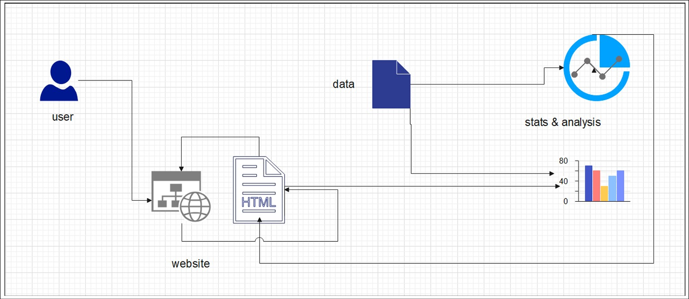
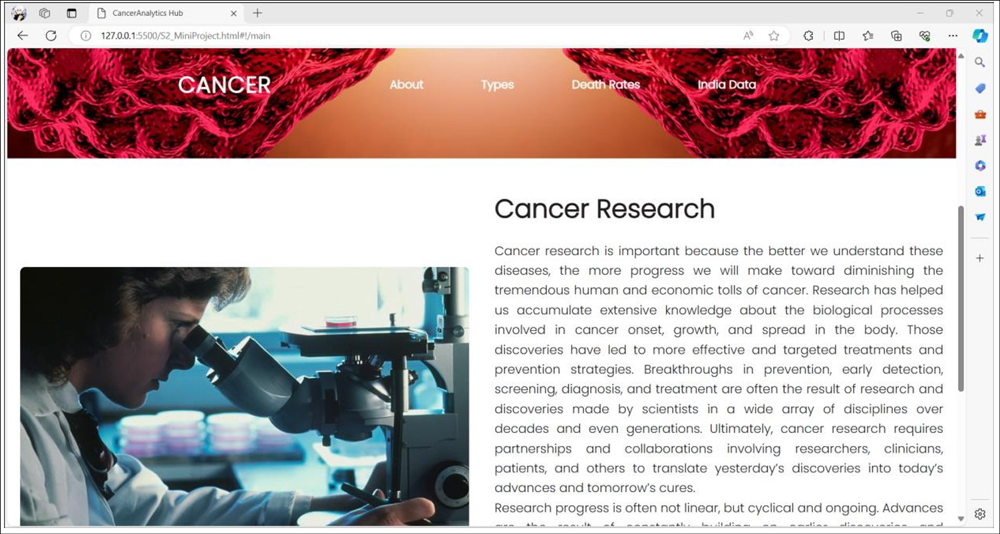
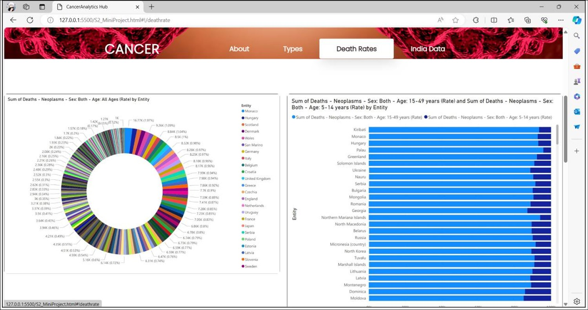
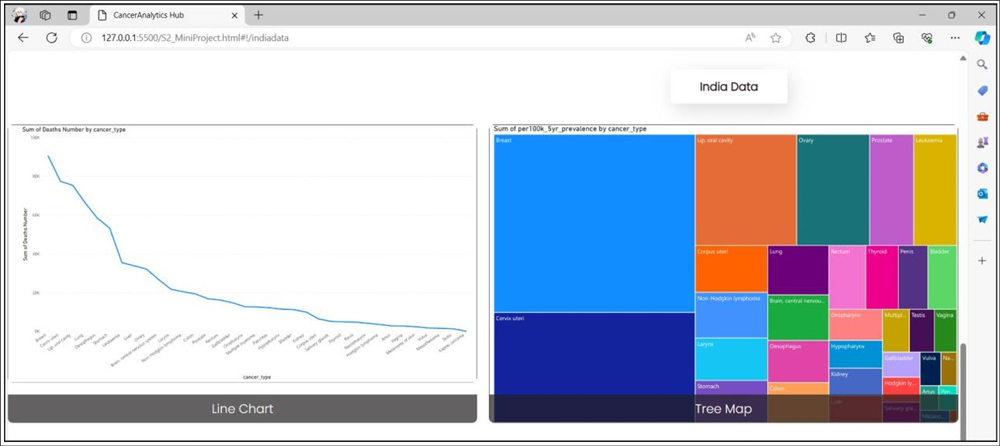
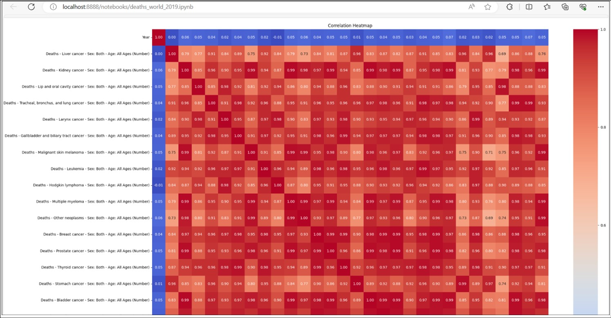
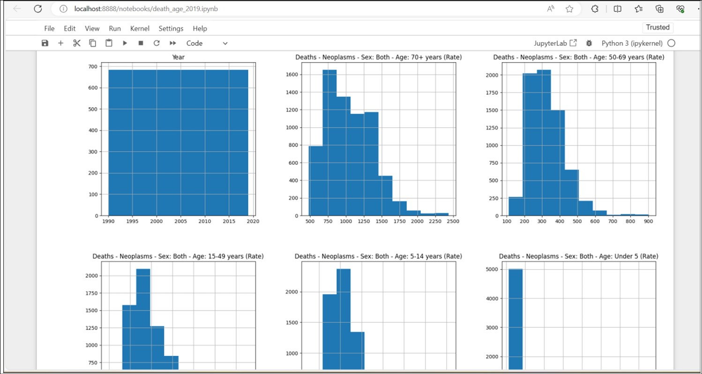

# Cancer_Website

The project's goal is to create an easily navigable cancer information website by 
employing data visualization techniques to display extensive datasets. Organizing 
various data kinds, creating powerful visuals, and making sure users are informed 
and engaged.

 

## Technologies Used :
- HTML/CSS  
- NodeJS  
- PowerBI   
- Jupyter  

 
 

 *System Design*

 

 *Website Main Page*

 

 *Analysis of deaths worldwide due to cancer till 2019*

 

 *Analysis of deaths in India due to cancer till 2019*

 

 *Heatmap*

 

 *Histogram*

 

